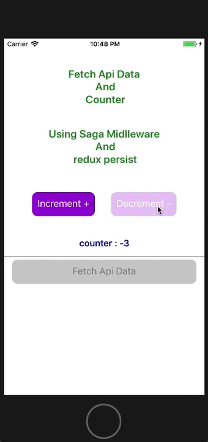

# Redux with [redux-saga](https://github.com/redux-saga/redux-saga) & [redux-persist](https://github.com/rt2zz/redux-persist/) *.
***
## I just create an Api which fetch a collecion of data from [rando user](https://randomuser.me/) *.
***
Screen: 

***
